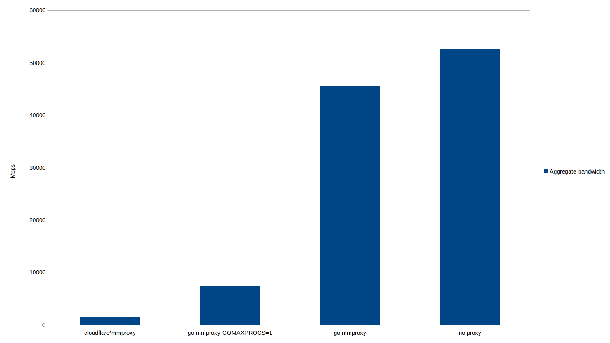

# go-mmproxy

This is a Go reimplementation of [mmproxy](https://github.com/cloudflare/mmproxy), created to improve on mmproxy's runtime stability while providing potentially greater performance in terms of connection and packet throughput.

`go-mmproxy` is a standalone application that unwraps HAProxy's [PROXY protocol](http://www.haproxy.org/download/1.8/doc/proxy-protocol.txt) (also adopted by other projects such as NGINX) so that the network connection to the end server comes from client's - instead of proxy server's - IP address and port number.
Because they share basic mechanisms, [Cloudflare's blogpost on mmproxy](https://blog.cloudflare.com/mmproxy-creative-way-of-preserving-client-ips-in-spectrum/) serves as a great write-up on how `go-mmproxy` works under the hood.

## Building

```shell
go get github.com/path-network/go-mmproxy
```

You'll need at least `go 1.11` to build the `go-mmproxy` binary.
See [Go's Getting Started](https://golang.org/doc/install) if your package manager does not carry new enough version of golang.

## Requirements

`go-mmproxy` has to be ran:

- on the same server as the proxy target, as the communication happens over the loopback interface;
- as root or with `CAP_NET_ADMIN` capability to be able to set `IP_TRANSPARENT` socket opt.

## Running

### Routing setup

Route all traffic originating from loopback back to loopback:

```shell
ip rule add from 127.0.0.1/8 iif lo table 123
ip route add local 0.0.0.0/0 dev lo table 123

ip -6 rule add from ::1/128 iif lo table 123
ip -6 route add local ::/0 dev lo table 123
```

If `--mark` option is given to `go-mmproxy`, all packets routed to the loopback interface will have the mark set.
This can be used for setting up more advanced routing rules with iptables, for example when you need traffic from loopback to be routed outside of the machine.

#### Routing UDP packets

Because UDP is connectionless, if a socket is bound to `0.0.0.0` the kernel stack will search for an interface in order to send a reply to the spoofed source address - instead of just using the interface it received the original packet from.
The found interface will most likely _not_ be the loopback interface, which will avoid the rules specified above.
The simplest way to fix this is to bind the end server's listeners to `127.0.0.1` (or `::1`).
This is also generally recommended in order to avoid receiving non-proxied connections.

### Starting go-mmproxy

```
Usage of ./go-mmproxy:
  -4 string
    	Address to which IPv4 traffic will be forwarded to (default "127.0.0.1:443")
  -6 string
    	Address to which IPv6 traffic will be forwarded to (default "[::1]:443")
  -allowed-subnets string
    	Path to a file that contains allowed subnets of the proxy servers
  -close-after int
    	Number of seconds after which UDP socket will be cleaned up (default 60)
  -l string
    	Address the proxy listens on (default "0.0.0.0:8443")
  -listeners int
    	Number of listener sockets that will be opened for the listen address (Linux 3.9+) (default 1)
  -mark int
    	The mark that will be set on outbound packets
  -p string
    	Protocol that will be proxied: tcp, udp (default "tcp")
  -v int
    	0 - no logging of individual connections
    	1 - log errors occurring in individual connections
    	2 - log all state changes of individual connections
```

Example invocation:

```shell
sudo ./go-mmproxy -l 0.0.0.0:25577 -4 127.0.0.1:25578 -6 [::1]:25578 --allowed-subnets ./path-prefixes.txt
```

## Benchmark

### Setup

The benchmark was ran on Dell XPS 9570 with Intel Core i9-8950HK CPU @ 2.90GHz (12 logical cores). The upstream service to which proxy sent traffic was mocked by [bpf-echo](https://github.com/path-network/bpf-echo) server.
Traffic was generated by [tcpkali](https://github.com/satori-com/tcpkali) v1.1.1 .

The following command was used for load generation in all cases (50 connections, 10s runtime, send PROXYv1 header for each connection, use `PING\r\n` as TCP message):

```
tcpkali -c 50 -T 10s -e1 'PROXY TCP4 127.0.0.1 127.0.0.1 \{connection.uid} 25578\r\n' -m 'PING\r\n' 127.0.0.1:1122
```

### Results

|                         | ⇅ Mbps    | ↓ Mbps    | ↑ Mbps    | ↓ pkt/s   | ↑ pkt/s   |
| ----------------------- | --------- | --------- | --------- | --------- | --------- |
| cloudflare/mmproxy      | 1524.454  | 756.385   | 768.069   | 70365.9   | 65921.9   |
| go-mmproxy GOMAXPROCS=1 | 7418.312  | 2858.794  | 4559.518  | 262062.7  | 391334.6  |
| go-mmproxy              | 45483.233 | 16142.348 | 29340.885 | 1477889.6 | 2518271.5 |
| no proxy                | 52640.116 | 22561.129 | 30078.987 | 2065805.4 | 2581621.3 |


